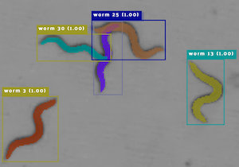
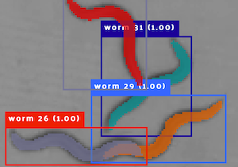
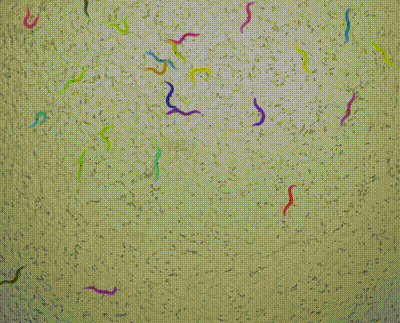

# WormSwin

Repository for [WormSwin: Instance segmentation of C. elegans using vision transformer](https://doi.org/10.1038/s41598-023-38213-7) published in Nature Scientific Reports 2023.

Examples taken from the paper.






## Installation

We used [MMDetection](https://github.com/open-mmlab/mmdetection) as toolbox for our network.
Please follow their [installation instructions](https://mmdetection.readthedocs.io/en/latest/get_started.html).
To manage our Python packages we used [(mini)conda](https://docs.conda.io/en/latest/miniconda.html).
Our environment YAML file to restore the package versions can be found in this repo.
Python version 3.8, PyTorch 1.11 for CUDA 11.3 and mmcv-full 1.5.3 was used for our setup.


## Usage

After installing MMDetection copy the configuration file from the worm-swin repo (network/config_wormswin_mmdetection.py) to the new installation (eg. into the configs folder).

The config file needs to be adapted:
- Line 1, 243: Path to pre-trained Swin backbone weights. Weights are available from [Microsoft Swin-Transformer GitHub](https://github.com/microsoft/Swin-Transformer). For our experiments we used Swin-L-V1 ImageNet-22K 384x384.
- Line 80-83, 141-144, 165-168: Set the correct path to your data, and your dataset type. We used the CocoDataset type and formatted the annotations accordingly (refer to [MMDetection Docs](https://mmdetection.readthedocs.io/en/latest/user_guides/train.html#train-with-customized-datasets)).
- Line 131-132, 156-157, 180-181: (Optional) Change the mean and standard deviation to the values of your dataset.
- Line 215: (Optional) To fine-tune our trained model on another dataset or to test our model without fine-tuning, add the path to our checkpoints (available from [Zenodo](https://doi.org/10.5281/zenodo.8254727)).
- Line 462: Output folder path
- Line 464: GPU ids to be used

The model can be trained using this command: `tools/dist_train.sh CONFIG_FILE NUM_GPUS`.
`NUM_GPUS` needs to be replaced with the number of GPUs to use and `CONFIG_FILE` with the path to the configuration file downloaded from this repository.

The trained model can be tested using the command: `tools/dist_test.sh CONFIG_FILE MODEL_WEIGHTS NUM_GPUS --eval bbox segm  --out RESULT_FILE`.
`NUM_GPUS` needs to be replaced with the number of GPUs to use and `CONFIG_FILE` with the path to the configuration file downloaded from this repository. `MODEL_WEIGHTS` needs to point to the model weight .pth file, probably located in the work_dir. `RESULT_FILE` needs to be replaced with the path + file name where the segmentation results should be stored.

Training/Fine-tuning can be skipped if our pre-trained weights from [Zenodo](https://doi.org/10.5281/zenodo.8254727) are used, but the segmentation accuracy might be worse.

The results .pkl file can be opened using python.
It contains detections per image. For each image MMDetection outputs the results form of confidence scores + bounding boxes at index 0 and size + segmentations in RLE format at index 1.
An example script to view and print prediction results can be found in `scripts/eval_results.py`.

## Datasets

* [WormSwin Datasets](https://doi.org/10.5281/zenodo.7456803) [](https://doi.org/10.5281/zenodo.7456803)
* [BBBC010](https://bbbc.broadinstitute.org/BBBC010)

## Model checkpoints

* [WormSwin Checkpoints](https://doi.org/10.5281/zenodo.8254728) [](https://doi.org/10.5281/zenodo.8254728)

## Used Hardware

We trained on 4 Nvidia Tesla V100-SMX2 32 GB GPUs, 6 cores of an Intel Xeon Gold 6248 CPU @ 2.50 GHz and 100 GB of RAM. With a batch size of four (one image per GPU) and two workers per GPU, training for 36 epochs took ∼ 19 h.


## Citation
```
@article{deserno_wormswin_2023,
	title = {{WormSwin}: {Instance} segmentation of {C}. elegans using vision transformer},
	volume = {13},
	copyright = {2023 The Author(s)},
	issn = {2045-2322},
	shorttitle = {{WormSwin}},
	url = {https://www.nature.com/articles/s41598-023-38213-7},
	doi = {10.1038/s41598-023-38213-7},
	language = {en},
	number = {1},
	urldate = {2023-07-10},
	journal = {Scientific Reports},
	author = {Deserno, Maurice and Bozek, Katarzyna},
	month = jul,
	year = {2023},
	note = {Number: 1
Publisher: Nature Publishing Group},
	keywords = {Behavioural methods, Machine learning, Software},
	pages = {11021},
}
```
